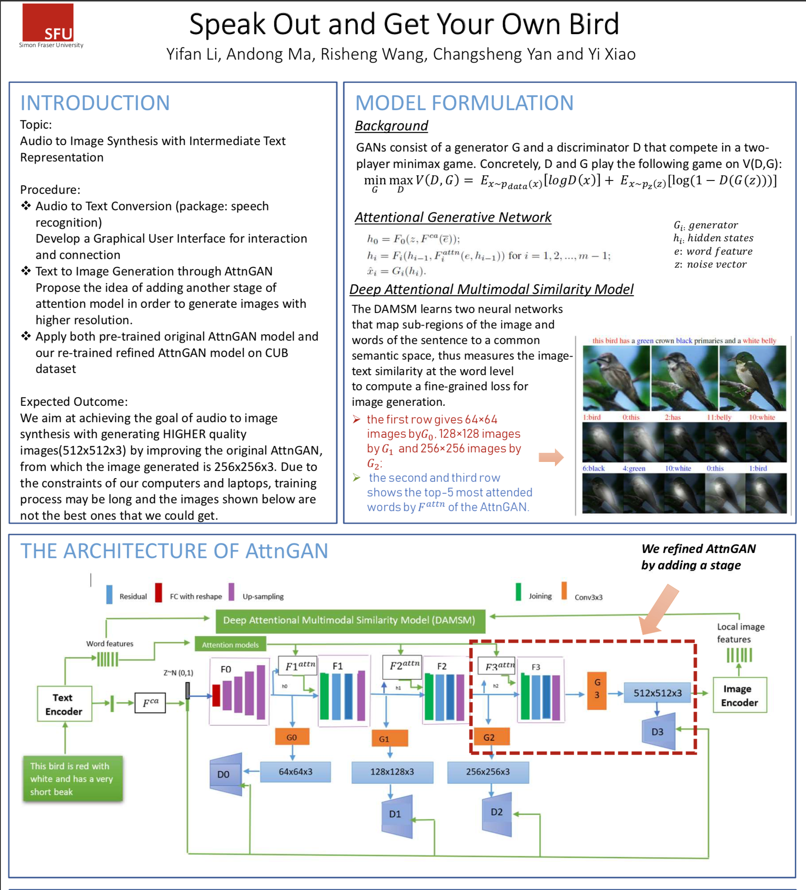
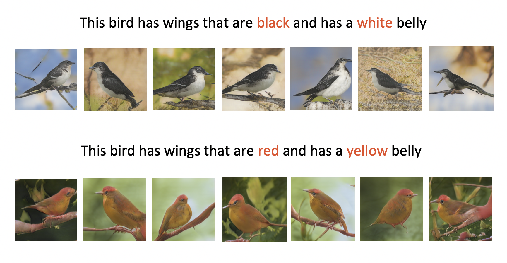
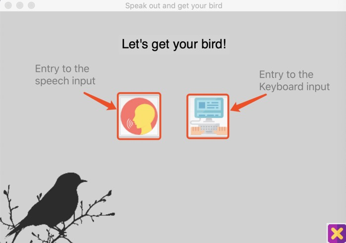
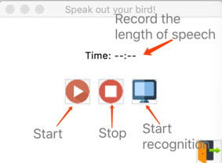
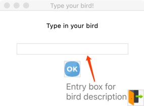
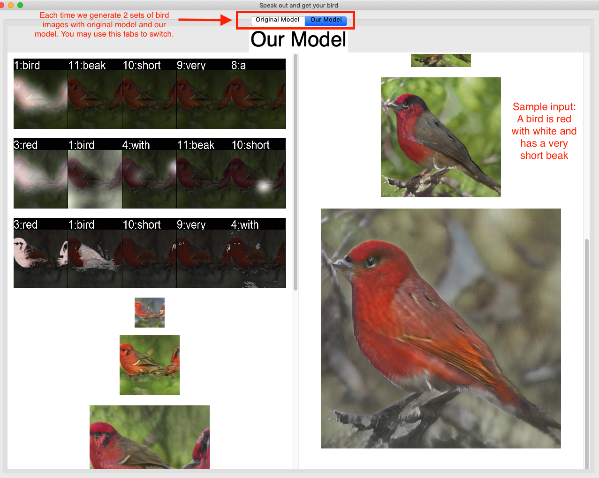

# Speak Out And Get Your Bird -- 2018Fall Final project for CMPT-732

## Introduction

- This is a simple TkInter GUI application that can transform your voice into images.  (Currently only bird supported)
- In this project, we trained a new model that has one more layer than the existing AttnGAN model, which is aim to increase the image resolution with richer details. Specifically, our model is able to generate a bird image with 512\*512 pixels while the existing AttnGAN model with 256\*256 pixels.
- The major purpose of this app is to let users can interact with our new model in a more directly and user-friendly way.
- What we base on is the AttnGAN Model, the Speech Recognition Package and a WAV recording functionality using pyaudio.
	- https://github.com/taoxugit/AttnGAN 
	- https://pypi.org/project/SpeechRecognition/
	- https://gist.github.com/sloria/5693955
- You can also find our most recently trained model at below url.
	- https://drive.google.com/file/d/1J_fgi0HSPFioG-QUuGa1AWk4pJlG7GZX/view?usp=sharing
- Framework

## How to use
### Dependencies
- Please make sure the python version is 2.7 and `pip install` all the following packages.
	- `python-dateutil`
	- `easydict`
	- `pandas`
	- `torchfile`
	- `nltk`
	- `scikit-image`
	- `torch`
	- `pyyaml`
	- `torchvision`
	- `pyaudio`
	
### Samples

### GUI
- Running Command:
	- python ./code/gui.py
- Main Interface

- Voice Input

- Text Input

- Output Birds

